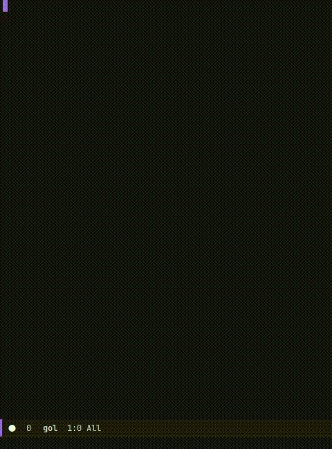

# Conway's Game of Life in Elisp

This was just a fun way to learn some elisp.

## Playing the game

Simply open `gol.el` in emacs and run `eval-buffer`, then `gol-start`.

The game runs on a timer and creates a new generation every 0.5s, to
stop the time run `gol-stop`.
